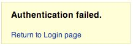
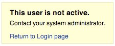

# Pruebas de Enumeración de Cuentas y Cuenta de Usuario Adivinable

|ID          |
|------------|
|WSTG-IDNT-04|

## Resumen

El alcance de esta prueba es verificar si es posible recolectar un conjunto de nombres de usuario válidos interactuando con el mecanismo de autenticación de la aplicación. Esta prueba será útil para pruebas de fuerza bruta, en las cuales el tester verifica si, dado un nombre de usuario válido, es posible encontrar la contraseña correspondiente.

A menudo, las aplicaciones web revelan cuando un nombre de usuario existe en el sistema, ya sea como consecuencia de mala configuración o como una decisión de diseño. Por ejemplo, a veces, cuando enviamos credenciales incorrectas, recibimos un mensaje que establece que el nombre de usuario está presente en el sistema o que la contraseña proporcionada es incorrecta. La información obtenida puede ser usada por un atacante para ganar una lista de usuarios en el sistema. Esta información puede usarse para atacar la aplicación web, por ejemplo, a través de un ataque de fuerza bruta o de nombre de usuario y contraseña por defecto.

El tester debería interactuar con el mecanismo de autenticación de la aplicación para entender si el envío de solicitudes particulares causa que la aplicación responda de diferentes maneras. Este problema existe porque la información liberada desde la aplicación web o servidor web cuando el usuario proporciona un nombre de usuario válido es diferente a cuando usan uno inválido.

En algunos casos, se recibe un mensaje que revela si las credenciales proporcionadas son incorrectas porque se usó un nombre de usuario inválido o una contraseña inválida. A veces, los testers pueden enumerar los usuarios existentes enviando un nombre de usuario y una contraseña vacía.

> Nota: Algunas aplicaciones no consideran los nombres de usuario sensibles, y podrían proporcionar funcionalidad que permite ver o listar directamente los nombres de usuario. Asegurarse de entender los requisitos de seguridad de la aplicación antes de reportar problemas alrededor de enumeración de nombre de usuario.

## Objetivos de Prueba

- Revisar procesos que pertenezcan a identificación de usuario (*por ejemplo* registro, login, etc.).
- Enumerar usuarios donde sea posible a través de análisis de respuesta.

## Cómo Probar

En pruebas de caja negra, el tester no sabe nada sobre la aplicación específica, nombre de usuario, lógica de aplicación, mensajes de error en la página de login, o facilidades de recuperación de contraseña. Si la aplicación es vulnerable, el tester recibe un mensaje de respuesta que revela, directa o indirectamente, alguna información útil para enumerar usuarios.

### Mensaje de Respuesta HTTP

#### Probar Credenciales Válidas

Registrar la respuesta del servidor cuando se envía un ID de usuario válido y contraseña válida.

> Usando un proxy web, notar la información recuperada de esta autenticación exitosa (Respuesta HTTP 200, longitud de la respuesta).

#### Probar Usuario Válido con Contraseña Incorrecta

Ahora, el tester debería intentar insertar un ID de usuario válido y una contraseña incorrecta y registrar el mensaje de error generado por la aplicación.

> El navegador debería mostrar un mensaje similar al siguiente:
>
> \
> *Figura 4.3.4-1: Authentication Failed*
>
> A diferencia de cualquier mensaje que revele la existencia del usuario como el siguiente:
>
> `Login for User foo: invalid password`
>
> Usando un proxy web, notar la información recuperada de este intento de autenticación no exitoso (Respuesta HTTP 200, longitud de la respuesta).

#### Probar un Nombre de Usuario Inexistente

Ahora, el tester debería intentar insertar un ID de usuario inválido y una contraseña incorrecta y registrar la respuesta del servidor (el tester debería estar confiado de que el nombre de usuario no es válido en la aplicación). Registrar el mensaje de error y la respuesta del servidor.

> Si el tester ingresa un ID de usuario no existente, podría recibir un mensaje similar a:
>
> \
> *Figura 4.3.4-3: This User is Not Active*
>
> o un mensaje como el siguiente:
>
> `Login failed for User foo: invalid Account`
>
> Generalmente la aplicación debería responder con el mismo mensaje de error y longitud a las diferentes solicitudes incorrectas. Si las respuestas no son las mismas, el tester debería investigar y averiguar la clave que crea una diferencia entre las dos respuestas. Por ejemplo:
>
> 1. Solicitud del cliente: Usuario válido/contraseña incorrecta
> 2. Respuesta del servidor: La contraseña no es correcta
> 3. Solicitud del cliente: Usuario incorrecto/contraseña incorrecta
> 4. Respuesta del servidor: Usuario no reconocido
>
> Las respuestas anteriores permiten al cliente entender que para la primera solicitud tienen un nombre de usuario válido. Así que pueden interactuar con la aplicación solicitando un conjunto de posibles IDs de usuario y observando la respuesta.
>
> Mirando la segunda respuesta del servidor, el tester entiende de la misma manera que no tienen un nombre de usuario válido. Así que pueden interactuar de la misma manera y crear una lista de IDs de usuario válidos mirando las respuestas del servidor.

### Otras Maneras de Enumerar Usuarios

Los testers pueden enumerar usuarios de varias maneras, tales como:

#### Analizar el Código de Error Recibido en Páginas de Login

Algunas aplicaciones web liberan un código de error o mensaje específico que podemos analizar.

#### Analizar URLs y Redirecciones de URL

Por ejemplo:

- `https://www.foo.com/err.jsp?User=baduser&Error=0`
- `https://www.foo.com/err.jsp?User=gooduser&Error=2`

Como se ve arriba, cuando un tester proporciona un ID de usuario y contraseña a la aplicación web, ven un mensaje de indicación de que ha ocurrido un error en la URL. En el primer caso han proporcionado un ID de usuario malo y contraseña mala. En el segundo, un ID de usuario bueno y una contraseña mala, así que pueden identificar un ID de usuario válido.

#### URI Probing

A veces un servidor web responde de manera diferente si recibe una solicitud para un directorio existente o no. Por ejemplo en algunos portales cada usuario está asociado a un directorio. Si los testers intentan acceder a un directorio existente podrían recibir un error del servidor web.

Algunos de los errores comunes recibidos de servidores web son:

- Código de error 403 Forbidden
- Código de error 404 Not found

Ejemplo:

- `https://www.foo.com/account1` - recibimos del servidor web: 403 Forbidden
- `https://www.foo.com/account2` - recibimos del servidor web: 404 file Not Found

En el primer caso el usuario existe, pero el tester no puede ver la página web, en el segundo caso en cambio el usuario "account2" no existe. Recolectando esta información los testers pueden enumerar los usuarios.

#### Analizar Títulos de Páginas Web

Los testers pueden recibir información útil en el Título de la página web, donde pueden obtener un código de error o mensajes específicos que revelan si los problemas son con el nombre de usuario o contraseña.

Por ejemplo, si un usuario no puede autenticarse a una aplicación y recibe una página web cuyo título es similar a:

- `Invalid user`
- `Invalid authentication`

#### Analizar un Mensaje Recibido de una Facilidad de Recuperación

Cuando usamos una facilidad de recuperación (i.e. una función de contraseña olvidada) una aplicación vulnerable podría devolver un mensaje que revela si un nombre de usuario existe o no.

Por ejemplo, mensajes similares a los siguientes:

- `Invalid username: email address is not valid or the specified user was not found.`
- `Valid username: Your password has been successfully sent to the email address you registered with.`

#### Mensaje de Error 404 Amigable

Cuando solicitamos un usuario dentro del directorio que no existe, no siempre recibimos código de error 404. En su lugar, podríamos recibir "200 OK" con una imagen, en este caso podemos asumir que cuando recibimos la imagen específica el usuario no existe. Esta lógica puede aplicarse a otra respuesta del servidor web; el truco es un buen análisis de mensajes del servidor web y aplicación web.

#### Analizar Tiempos de Respuesta

Así como mirar el contenido de las respuestas, el tiempo que toma la respuesta también debería considerarse. Particularmente donde la solicitud causa una interacción con un servicio externo (tal como enviar un correo electrónico de contraseña olvidada), esto puede añadir varios cientos de milisegundos a la respuesta, lo cual puede usarse para determinar si el usuario solicitado es válido.

### Adivinar Usuarios

#### Estructuras Predecibles de Nombre de Usuario

En muchas organizaciones, los nombres de usuario siguen patrones consistentes (por ejemplo, inicial del nombre + apellido tal como jbloggs, o identificadores estructurados tales como CN000100). Si la convención de nomenclatura puede identificarse, los nombres de usuario válidos a menudo pueden derivarse sistemáticamente.

Los testers deberían:

- Identificar si los nombres de usuario siguen una estructura predecible.
- Intentar generar nombres de usuario adicionales basados en patrones observados.
- Usar diccionarios de nombre de usuario derivados de datos organizacionales (por ejemplo, nombres de personal, formatos de email).
- Observar respuestas de la aplicación para determinar si los nombres de usuario generados son válidos.

Las estructuras predecibles de nombre de usuario reducen significativamente el esfuerzo requerido para enumerar cuentas válidas y pueden facilitar ataques adicionales tales como intentos de fuerza bruta.

En algunos casos los IDs de usuario se crean con políticas específicas de administrador o compañía. Por ejemplo podemos ver un usuario con un ID de usuario creado en orden secuencial:

```text
CN000100
CN000101
...
```

A veces los nombres de usuario se crean con un alias REALM y luego números secuenciales:

- R1001 – usuario 001 para REALM1
- R2001 – usuario 001 para REALM2

En el ejemplo anterior podemos crear scripts shell simples que componen IDs de usuario y envían una solicitud con herramienta como wget para automatizar una consulta web para discernir IDs de usuario válidos. Para crear un script también podemos usar Perl y curl.

Otras posibilidades son: - IDs de usuario asociados con números de tarjeta de crédito, o en general números con un patrón. - IDs de usuario asociados con nombres reales, por ejemplo, si Freddie Mercury tiene un ID de usuario de "fmercury", entonces podrías adivinar que Roger Taylor tiene el ID de usuario de "rtaylor".

Nuevamente, podemos adivinar un nombre de usuario de la información recibida de una consulta LDAP o de recolección de información de Google, por ejemplo, de un dominio específico. Google puede ayudar a encontrar usuarios de dominio a través de consultas específicas o a través de un script shell simple o herramienta.

> Al enumerar cuentas de usuario, se arriesga a bloquear cuentas después de un número predefinido de sondas fallidas (basado en la política de aplicación). Además, a veces, la dirección IP puede ser baneada por reglas dinámicas en el firewall de aplicación o Sistema de Prevención de Intrusos.

### Probar Suplantación de Personal

Asegurar que los usuarios no registrados no puedan seleccionar nombres de usuario reservados (por ejemplo, admin, administrator, moderator) durante el proceso de registro. Adicionalmente, verificar que los usuarios no puedan editar su nombre de usuario actual a uno de estos nombres de usuario reservados en la página de edición de perfil.

Si la aplicación web tiene características que permiten a un usuario acceder a la funcionalidad de registro y edición de perfil de la aplicación web, las interacciones a probar incluyen las siguientes:

- Proceso de registro:
    - Acceder a la página de registro como usuario no registrado y llenar el formulario de registro, ingresando uno de los nombres de usuario reservados (por ejemplo, admin, administrator, moderator), enviar el formulario de registro, y luego verificar la respuesta.
    - El proceso de registro debería rechazar el envío del formulario y mostrar un mensaje de error indicando que el nombre de usuario seleccionado no está disponible para registro.
- Página de edición de perfil:
    - Iniciar sesión en la aplicación web usando credenciales válidas y navegar a la página de edición de perfil. Intentar cambiar el nombre de usuario actual a uno de los nombres de usuario reservados (por ejemplo, admin, administrator, moderator) y guardar los cambios para verificar el comportamiento.
    - El proceso de edición de perfil debería rechazar la solicitud de cambio de nombre de usuario y mostrar un mensaje de error indicando que el nombre de usuario seleccionado no está disponible.
- Probar variantes y similitudes:
    - Repetir los pasos anteriores para diferentes variaciones de los nombres de usuario reservados (por ejemplo, Admin, ADMIN, Administrator) y realizar pruebas con diferentes combinaciones de letras mayúsculas y minúsculas para asegurar que la insensibilidad a mayúsculas se maneje correctamente.
    - La aplicación web debería tratar estas variantes como idénticas a los nombres de usuario reservados, rechazando su selección o modificación.

### Pruebas de Caja Gris

#### Probar Mensajes de Error de Autenticación

Verificar que la aplicación responda de la misma manera para cada solicitud del cliente que produce una autenticación fallida. Para este problema las pruebas de caja negra y caja gris tienen el mismo concepto basado en el análisis de mensajes o códigos de error recibidos de la aplicación web.

> La aplicación debería responder de la misma manera para cada intento fallido de autenticación.
>
> Por Ejemplo: *Credentials submitted are not valid*

## Remediación

Asegurar que la aplicación devuelve mensajes de error genéricos consistentes en respuesta a nombre de cuenta, contraseña u otras credenciales de usuario inválidas ingresadas durante el proceso de login.

Asegurar que las cuentas de sistema por defecto y cuentas de prueba se eliminen antes de liberar el sistema a producción (o exponerlo a una red no confiable).

## Herramientas

- [Zed Attack Proxy (ZAP)](https://www.zaproxy.org)
- [curl](https://curl.haxx.se/)
- [PERL](https://www.perl.org)

## Referencias

- [Username Enumeration Vulnerabilities](https://www.gnucitizen.org/blog/username-enumeration-vulnerabilities/)
- [Prevent WordPress Username Enumeration](https://www.jinsonvarghese.com/prevent-wordpress-username-enumeration/)
- [Marco Mella, Sun Java Access & Identity Manager Users enumeration](https://www.exploit-db.com/exploits/32762)
