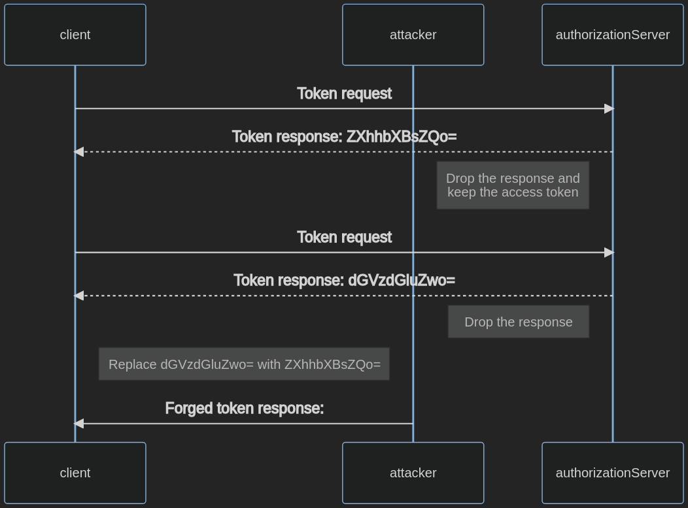

# Pruebas de Debilidades del Cliente de OAuth

## Resumen

OAuth otorga derechos de acceso sobre recursos a los clientes. Esto les permite actuar en nombre del propietario del recurso. El cliente recibe el código de autorización y token de refresco en el intercambio de token y los almacena.

Fallar en proteger el intercambio de token y credenciales podría resultar en acceso no autorizado a recursos y elevación de privilegios.

## Objetivos de Prueba

- Identificar debilidades en el cliente de OAuth.

## Cómo Probar

Para probar las debilidades del cliente, apuntarás a:

1. Recuperar credenciales usadas para autorización.
2. Otorgarte acceso a recursos arbitrarios a través de navegación forzada.
3. Evadir la autorización.

### Probar Client Secret Expuesto

El client secret se usa para autenticar al cliente contra el Servidor de Autorización (AS) para probar que el cliente es un origen confiable.

Los clientes públicos generalmente no pueden almacenar el client secret de manera segura.

Para identificar el client secret en código del lado del cliente, conducir reconocimiento en el código del lado del cliente.

1. Navegar a la aplicación.
2. Abrir las herramientas de desarrollador del navegador.
3. Navegar a la pestaña Debugger.
4. Presionar Ctrl+Shift+F para abrir la búsqueda.
5. Buscar términos similares a `client-secret` y determinar si se encuentran algunos.

Si esto no es exitoso, también puedes:

1. Pasar por el proceso de autorización con un proxy de intercepción HTTP como ZAP.
2. Recuperar el client secret de la URI en el parámetro `client-secret`.
3. Reemplazar el término de búsqueda en la búsqueda anterior con el valor del client secret y determinar si está expuesto.

### Probar Almacenamiento Improper de Token

El cliente recibe tokens de acceso e idealmente los almacena en una ubicación donde esos tokens puedan protegerse de atacantes.

Los clientes confidenciales deberían almacenar tokens en memoria volátil para prevenir acceso a través de otros ataques tales como local file inclusion, atacantes que son capaces de acceder al entorno, o ataques de SQL Injection.

Los clientes públicos, tales como aplicaciones de página única, no tienen la posibilidad de almacenar tokens de manera segura. Por ejemplo, un ataque de cross-site scripting permite a los atacantes acceder a credenciales almacenadas en el navegador.

Los clientes públicos podrían almacenar tokens en el session storage del navegador o en una cookie, pero no en el local storage. Para determinar si los tokens se almacenan impropiamente:

1. Navegar a la aplicación.
2. Recuperar un token de acceso.
3. Abrir las herramientas de desarrollador del navegador.
4. Navegar a la pestaña Application.
5. Localizar el Local Storage y ver los datos almacenados.
6. Localizar el Session Storage y ver los datos almacenados.
7. Localizar el Cookie Store y ver los datos almacenados.

### Probar Inyección de Token de Acceso

Este ataque solo es posible cuando el cliente usa un response type que emite directamente un token de acceso al cliente. Esto ocurre con los tipos de grant Implicit Flows, Resource Owner Password Credential, y flujos máquina-a-máquina. Ver [Pruebas de Debilidades de OAuth](05-Testing_for_OAuth_Weaknesses.md) para más descripción.

La inyección de token de acceso es exitosa cuando un token de acceso se filtra a un atacante y luego se usa para autenticarse con el cliente legítimo.

Para probar la inyección de token de acceso, seguir los pasos a continuación. En este ejemplo, el token de autorización (`ZXhhbXBsZQo=`) se filtró.

1. Intercepta el tráfico entre el cliente y el servidor de autorización.
2. Inicia un flujo de OAuth con un cliente usando el tipo de grant Implicit Flow.
3. Inyecta el token de acceso robado:
    - Envía una respuesta de autorización forjada con el token de acceso robado (`ZXhhbXBsZQo=`) al cliente.
    - Intercepta una respuesta de autorización válida y reemplaza el token de acceso (`dGVzdGluZwo=`) con el filtrado (`ZXhhbXBsZQo=`).

\
*Figura 4.5.5.2-: Flujo de Inyección de Token de Acceso*

## Casos de Prueba Relacionados

- [Pruebas de Cross Site Request Forgery](../06-Session_Management_Testing/05-Testing_for_Cross_Site_Request_Forgery.md)
- [Pruebas de Redirección de URL del Lado del Cliente](../11-Client-side_Testing/04-Testing_for_Client-side_URL_Redirect.md)
- [Pruebas de JSON Web Tokens](../06-Session_Management_Testing/10-Testing_JSON_Web_Tokens.md)
- [Pruebas de Clickjacking](../11-Client-side_Testing/09-Testing_for_Clickjacking.md)
- [Pruebas de Cross Origin Resource Sharing](../11-Client-side_Testing/07-Testing_Cross_Origin_Resource_Sharing.md)

## Remediación

- Usar un client secret solo si el cliente tiene la capacidad de almacenarlo de manera segura.
- Seguir mejores prácticas para almacenar tokens de manera segura. Tratarlos con las mismas consideraciones de seguridad que otras credenciales.
- Evitar tipos de grant de OAuth obsoletos. Ver [Pruebas de Debilidades de OAuth](05-Testing_for_OAuth_Weaknesses.md) para más descripción.

## Herramientas

- [BurpSuite](https://portswigger.net/burp/releases)
- [EsPReSSO](https://github.com/portswigger/espresso)
- [ZAP](https://www.zaproxy.org/)

## Referencias

- [User Authentication with OAuth 2.0](https://oauth.net/articles/authentication/)
- [The OAuth 2.0 Authorization Framework](https://datatracker.ietf.org/doc/html/rfc6749)
- [The OAuth 2.0 Authorization Framework: Bearer Token Usage](https://datatracker.ietf.org/doc/html/rfc6750)
- [OAuth 2.0 Threat Model and Security Considerations](https://datatracker.ietf.org/doc/html/rfc6819)
- [OAuth 2.0 Security Best Current Practice](https://datatracker.ietf.org/doc/html/draft-ietf-oauth-security-topics-16)
- [Authorization Code Flow with Proof Key for Code Exchange](https://auth0.com/docs/authorization/flows/authorization-code-flow-with-proof-key-for-code-exchange-pkce)
