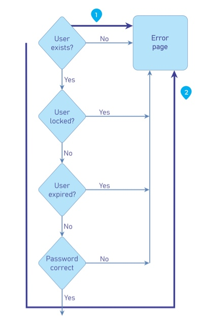

# Probar el Tiempo del Proceso

|ID          |
|------------|
|WSTG-BUSL-04|

## Resumen

Es posible que los atacantes puedan recolectar información sobre una aplicación monitoreando el tiempo que toma completar una tarea o dar una respuesta. Adicionalmente, los atacantes podrían ser capaces de manipular y romper los flujos de proceso de negocio diseñados simplemente manteniendo sesiones activas abiertas y no enviando sus transacciones en el marco de tiempo "esperado".

Las vulnerabilidades lógicas de tiempo de proceso son únicas en que estos casos de uso indebido manuales deberían ser creados considerando el tiempo de ejecución y transacción que son específicos de la aplicación/sistema.

El tiempo de procesamiento podría dar/filtrar información sobre lo que se está haciendo en los procesos en segundo plano de la aplicación/sistema. Si una aplicación permite a los usuarios adivinar cuál será el resultado particular siguiente por variaciones en el tiempo de procesamiento, los usuarios serán capaces de ajustarse en consecuencia y cambiar el comportamiento basado en la expectativa y "jugar con el sistema".

### Ejemplo 1

Las máquinas de juego de video/tragamonedas podrían tomar más tiempo en procesar una transacción justo antes de un gran pago. Esto permitiría a los jugadores astutos jugar montos mínimos hasta que vean el largo tiempo de procesamiento que entonces les pediría apostar el máximo.

### Ejemplo 2

Muchos procesos de log on de sistema piden el nombre de usuario y la contraseña. Si se mira de cerca se podría ver que ingresar un nombre de usuario inválido y una contraseña de usuario inválida toma más tiempo en devolver un error que ingresar un nombre de usuario válido y una contraseña de usuario inválida. Esto podría permitir al atacante saber si tienen un nombre de usuario válido y no necesitar confiar en el mensaje GUI.

Un problema similar podría estar presente en la funcionalidad de reseteo de contraseña que enviaría un correo electrónico al usuario con un enlace olvidado o código, ya que enviar correos electrónicos puede ser significativamente más lento que simplemente devolver la respuesta HTTP.

\
*Figura 4.10.4-1: Ejemplo de Flujo de Control de Formulario de Login*

### Ejemplo 3

La mayoría de las arenas o agencias de viajes tienen aplicaciones de ticketing que permiten a los usuarios comprar boletos y reservar asientos. Cuando el usuario solicita los boletos, los asientos que selecciona se bloquean o reservan pendientes de pago. ¿Qué pasa si un atacante sigue reservando asientos pero no haciendo checkout? ¿Se liberarán los asientos, o no se venderán boletos? Algunos vendedores de boletos ahora solo permiten a los usuarios 5 minutos para completar una transacción o la transacción se invalida.

### Ejemplo 4

Suponer que un sitio de e-commerce de metales preciosos permite a los usuarios hacer compras con una cotización de precio basada en el precio de mercado al momento en que inician sesión. ¿Qué pasa si un atacante inicia sesión y coloca una orden pero no completa la transacción hasta más tarde en el día solo si el precio de los metales sube? ¿Obtendrá el atacante el precio inicial más bajo?

## Objetivos de Prueba

- Revisar la documentación del proyecto para funcionalidades del sistema que puedan ser impactadas por el tiempo.
- Desarrollar y ejecutar casos de uso indebido.

## Cómo Probar

El tester debería identificar qué procesos dependen del tiempo, ya sea una ventana para que una tarea se complete, o si era tiempo de ejecución entre dos procesos que podría permitir la evasión de ciertos controles.

Siguiendo eso, es mejor automatizar las solicitudes que abusarán de los procesos descubiertos anteriormente, ya que las herramientas están mejor adaptadas para analizar el tiempo y son más precisas que las pruebas manuales. Si esto no es posible, todavía se podrían usar pruebas manuales.

El tester debería dibujar un diagrama de cómo fluye el proceso, los puntos de inyección, y preparar las solicitudes con anticipación para lanzarlas contra los procesos vulnerables. Una vez hecho, se debería hacer un análisis cercano para identificar diferencias en la ejecución del proceso, y si el proceso se está comportando mal contra la lógica de negocio acordada.

## Casos de Prueba Relacionados

- [Pruebas de Atributos de Cookies](../06-Session_Management_Testing/02-Testing_for_Cookies_Attributes.md)
- [Pruebas de Timeout de Sesión](../06-Session_Management_Testing/07-Testing_Session_Timeout.md)

## Remediación

Desarrollar aplicaciones con el tiempo de procesamiento en mente. Si los atacantes pudieran posiblemente ganar algún tipo de ventaja de conocer los diferentes tiempos de procesamiento y resultados, añadir pasos extra o procesamiento para que no importe los resultados que se proporcionen en el mismo marco de tiempo.

Adicionalmente, la aplicación/sistema debe tener mecanismos en su lugar para no permitir a los atacantes extender transacciones sobre una cantidad "aceptable" de tiempo. Esto podría hacerse cancelando o reseteando transacciones después de que haya pasado una cantidad de tiempo especificada como algunos vendedores de boletos ahora están usando.
