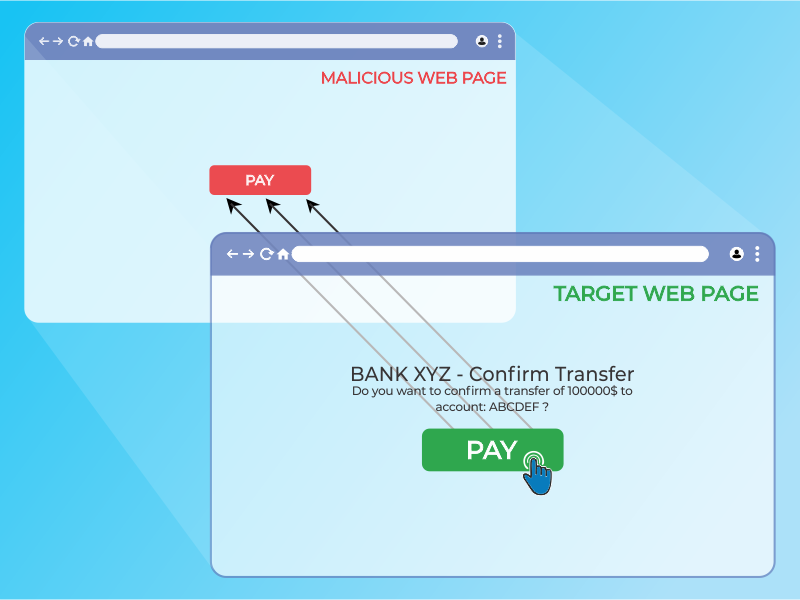
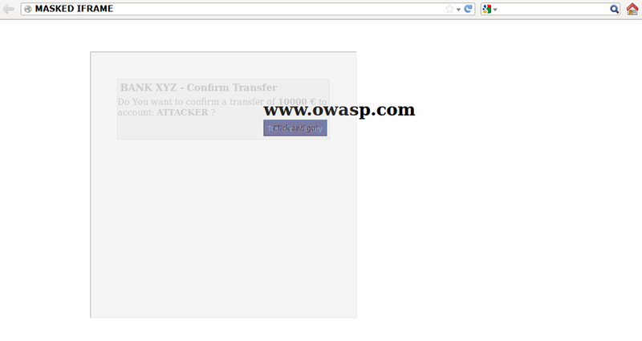

# Pruebas de Clickjacking

|ID          |
|------------|
|WSTG-CLNT-09|

## Resumen

Clickjacking, un subconjunto de UI redressing, es una técnica maliciosa mediante la cual un usuario web es engañado para interactuar (en la mayoría de los casos haciendo clic) con algo distinto a lo que el usuario cree que está interactuando. Este tipo de ataque, ya sea solo o en conjunto con otros ataques, podría potencialmente enviar comandos no autorizados o revelar información confidencial mientras la víctima interactúa con páginas web aparentemente inofensivas. El término clickjacking fue acuñado por Jeremiah Grossman y Robert Hansen en 2008.

Un ataque de clickjacking usa características aparentemente inofensivas de HTML y JavaScript para forzar a la víctima a realizar acciones no deseadas, tales como hacer clic en un botón invisible que realiza una operación no intencionada. Este es un problema de seguridad del lado del cliente que afecta a una variedad de navegadores y plataformas.

Para llevar a cabo este ataque, un atacante crea una página web aparentemente inofensiva que carga la aplicación objetivo a través del uso de un marco en línea (concealado con código CSS). Una vez hecho esto, un atacante puede inducir a la víctima a interactuar con la página web por otros medios (a través, por ejemplo, de ingeniería social). Como en otros ataques, un requisito común es que la víctima esté autenticada contra la aplicación objetivo del atacante.

\
*Figura 4.11.9-1: Ilustración de marco en línea de Clickjacking*

La víctima navega la página web del atacante con la intención de interactuar con la interfaz de usuario visible, pero inadvertidamente está realizando acciones en la página web oculta. Usando la página oculta, un atacante puede engañar a los usuarios para que realicen acciones que nunca tuvieron intención de realizar a través del posicionamiento de los elementos ocultos en la página web.

\
*Figura 4.11.9-2: Ilustración de marco en línea enmascarado*

El poder de este método es que las acciones realizadas por la víctima se originan desde la página web objetivo oculta pero auténtica. Consecuentemente, algunas de las protecciones anti-CSRF desplegadas por los desarrolladores para proteger la página web de ataques CSRF podrían ser evadidas.

## Objetivos de Prueba

- Evaluar la vulnerabilidad de la aplicación a ataques de clickjacking.

## Cómo Probar

Como se mencionó anteriormente, este tipo de ataque a menudo está diseñado para permitir a un atacante inducir acciones de los usuarios en el sitio objetivo, incluso si se están usando tokens anti-CSRF.

### Cargar la Página Web Objetivo en un Intérprete HTML Usando la Etiqueta iframe de HTML

Los sitios que no están protegidos contra frame busting son vulnerables a ataques de clickjacking. Si la página web `https://www.target.site` se carga exitosamente en un marco, entonces el sitio es vulnerable a Clickjacking. Un ejemplo de código HTML para crear esta página web de prueba se muestra en el siguiente fragmento:

```html
    <html>
        <head>
            <title>Clickjack test web page</title>
        </head>
        <body>
            <iframe src="https://www.target.site" width="400" height="400"></iframe>
        </body>
    </html>
```

### Probar la Aplicación contra JavaScript Deshabilitado

Dado que estos tipos de protecciones del lado del cliente dependen de código JavaScript de frame busting, si la víctima tiene JavaScript deshabilitado o es posible para un atacante deshabilitar el código JavaScript, la página web no tendrá ningún mecanismo de protección contra clickjacking.

Hay pocas técnicas de desactivación que pueden ser usadas con marcos. Técnicas más profundas pueden encontrarse en la [Hoja de Referencia de Defensa contra Clickjacking](https://cheatsheetseries.owasp.org/cheatsheets/Clickjacking_Defense_Cheat_Sheet.html).

### Atributo Sandbox

Con HTML5 un nuevo atributo llamado "sandbox" está disponible. Habilita un conjunto de restricciones sobre el contenido cargado en el iframe.

Ejemplo:

```html
<iframe src="https://example.org" sandbox></iframe>
```

### Probar la Aplicación en Modo de Compatibilidad y Accesibilidad

Las versiones móviles de la página web usualmente son más pequeñas y rápidas que las de escritorio, y tienen que ser menos complejas que la aplicación principal. Las variantes móviles a menudo tienen menos protección. Sin embargo, un atacante puede falsificar el origen real dado por un navegador web, y una víctima no móvil podría ser capaz de visitar una aplicación hecha para usuarios móviles. Este escenario podría permitir al atacante explotar una versión móvil de la página web.

Las aplicaciones que se ejecutan en modo de accesibilidad también deberían ser probadas contra clickjacking, porque el enmarcado del sitio podría verse afectado.

### Protección del Lado del Servidor: Usar la Directiva Frame-Ancestors de la Política de Seguridad de Contenido

El encabezado de respuesta HTTP Content-Security-Policy (CSP) permite a los administradores de páginas web controlar los recursos que el user-agent tiene permitido cargar para una página web dada. La directiva `frame-ancestors` en el HTTP CSP especifica los padres aceptables que pueden embeber una página web usando las etiquetas `<frame>`, `<iframe>`, `<object>`, `<embed>` o `<applet>`.

#### Probando el Encabezado de Respuesta Content Security Policy

- Usando un navegador, abrir las herramientas de desarrollador y acceder a la página web objetivo. Navegar a la pestaña Network.
- Buscar la solicitud que carga la página web. Debería tener el mismo dominio que la página web - usualmente ser el primer ítem en la pestaña Network.
- Una vez que hagas clic en el archivo, más información aparecerá. Buscar un código de respuesta 200 OK.
- Desplazarse hacia abajo hasta la Sección Response Header. La sección Content-Security-Policy indica el nivel de protección adoptado.

Alternativamente, ver el código fuente de la página web para encontrar Content-Security-Policy en una meta etiqueta. WSTG tiene información detallada en [Pruebas de Content Security Policy](../02-Configuration_and_Deployment_Management_Testing/12-Test_for_Content_Security_Policy.md).

##### Proxies

Los proxies web son conocidos por añadir y eliminar encabezados. En el caso en que un proxy web elimine el encabezado `X-FRAME-OPTIONS`, entonces el sitio pierde su protección de enmarcado.

##### Versión Móvil de la Aplicación

En este caso, debido a que el encabezado HTTP `X-FRAME-OPTIONS` tiene que ser implementado en cada página de la aplicación, los desarrolladores podrían no haber protegido cada página individual en la versión móvil.

### Remediación

- Para medidas para prevenir Clickjacking, ver la [Hoja de Referencia de Defensa contra Clickjacking](https://cheatsheetseries.owasp.org/cheatsheets/Clickjacking_Defense_Cheat_Sheet.html).
- Para laboratorios interactivos sobre Clickjacking visitar [Port Swigger Web Page](https://portswigger.net/web-security/clickjacking)
- Para recursos adicionales sobre ClickJacking visitar la [comunidad OWASP](https://owasp.org/www-community/attacks/Clickjacking)

## Referencias

- [OWASP Clickjacking](https://owasp.org/www-community/attacks/Clickjacking)
- [Wikipedia Clickjacking](https://en.wikipedia.org/wiki/Clickjacking)
- [Gustav Rydstedt, Elie Bursztein, Dan Boneh, y Collin Jackson: "Busting Frame Busting: a Study of Clickjacking Vulnerabilities on Popular Sites"](https://seclab.stanford.edu/websec/framebusting/framebust.pdf)
