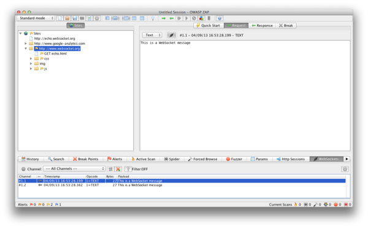
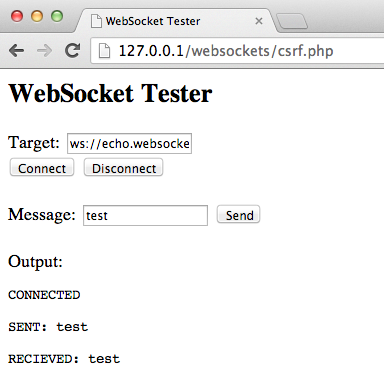

# Pruebas de WebSockets

|ID          |
|------------|
|WSTG-CLNT-10|

## Resumen

Tradicionalmente, el protocolo HTTP solo permite una solicitud/respuesta por conexión TCP. Asynchronous JavaScript and XML (AJAX) permite a los clientes enviar y recibir datos asíncronamente (en segundo plano sin un refresh de página) al servidor; sin embargo, AJAX requiere que el cliente inicie las solicitudes y espere las respuestas del servidor (half-duplex).

[WebSockets](https://html.spec.whatwg.org/multipage/web-sockets.html#network) permiten al cliente o servidor crear un canal de comunicación 'full-duplex' (bidireccional), permitiendo al cliente y servidor comunicarse verdaderamente de forma asíncrona. Los WebSockets conducen su *handshake* (apretón de manos) inicial de upgrade sobre HTTP y desde entonces toda la comunicación se lleva a cabo sobre canales TCP mediante el uso de frames. Para más información, ver el [Protocolo WebSocket](https://tools.ietf.org/html/rfc6455).

### Origin

Es responsabilidad del servidor verificar el [encabezado `Origin`](https://developer.mozilla.org/en-US/docs/Web/HTTP/Headers/Origin) en el handshake HTTP WebSocket inicial. Si el servidor no valida el encabezado origin en el handshake WebSocket inicial, el servidor WebSocket podría aceptar conexiones de cualquier origen. Esto podría permitir a los atacantes comunicarse con el servidor WebSocket cross-domain permitiendo problemas similares a CSRF. Ver también [Top 10-2017 A5-Broken Access Control](https://owasp.org/www-project-top-ten/2017/A5_2017-Broken_Access_Control). El exploit para esta debilidad se llama Cross-Site Websocket Hijacking (CSWH o CSWSH).

### Confidencialidad e Integridad

Los WebSockets pueden ser usados sobre TCP no cifrado o sobre TLS cifrado. Para usar WebSockets no cifrados se usa el esquema de URI `ws://` (puerto por defecto 80), para usar WebSockets cifrados (TLS) se usa el esquema de URI `wss://` (puerto por defecto 443). Ver también [Top 10-2017 A3-Sensitive Data Exposure](https://owasp.org/www-project-top-ten/2017/A3_2017-Sensitive_Data_Exposure).

### Saneamiento de Entrada

Como con cualquier dato originado de fuentes no confiables, los datos deberían ser saneados y codificados apropiadamente. Ver también [Top 10-2017 A1-Injection](https://owasp.org/www-project-top-ten/2017/A1_2017-Injection) y [Top 10-2017 A7-Cross-Site Scripting (XSS)](https://owasp.org/www-project-top-ten/2017/A7_2017-Cross-Site_Scripting_(XSS)).

## Objetivos de Prueba

- Identificar el uso de WebSockets.
- Evaluar su implementación usando las mismas pruebas en canales HTTP normales.

## Cómo Probar

### Pruebas de Caja Negra

1. Identificar que la aplicación está usando WebSockets.
   - Inspeccionar el código fuente del lado del cliente buscando el esquema de URI `ws://` o `wss://`.
   - Usar las Herramientas de Desarrollador de Google Chrome para ver la comunicación Network WebSocket.
   - Usar la pestaña WebSocket de [ZAP](https://www.zaproxy.org).
2. Origin.
   - Usando un cliente WebSocket (uno puede ser encontrado en la sección Tools a continuación) intentar conectar al servidor WebSocket remoto. Si se establece una conexión el servidor podría no estar verificando el encabezado origin del handshake WebSocket.
3. Confidencialidad e Integridad.
   - Verificar que la conexión WebSocket esté usando TLS para transportar información sensible `wss://`.
   - Verificar la Implementación HTTPS en busca de problemas de seguridad (Certificado Válido, BEAST, CRIME, RC4, etc). Referirse a la sección [Pruebas de Seguridad de Capa de Transporte Débil](../09-Testing_for_Weak_Cryptography/01-Testing_for_Weak_Transport_Layer_Security.md) de esta guía.
4. Autenticación.
   - Los WebSockets no manejan autenticación, se deberían llevar a cabo pruebas normales de autenticación de caja negra. Referirse a las secciones de [Pruebas de Autenticación](../04-Authentication_Testing/README.md) de esta guía.
5. Autorización.
   - Los WebSockets no manejan autorización, se deberían llevar a cabo pruebas normales de autorización de caja negra. Referirse a las secciones de [Pruebas de Autorización](../05-Authorization_Testing/README.md) de esta guía.
6. Saneamiento de Entrada.
   - Usar la pestaña WebSocket de [ZAP](https://www.zaproxy.org) para replay y fuzz de solicitudes y respuestas WebSocket. Referirse a las secciones de [Pruebas de Validación de Datos](../07-Input_Validation_Testing/README.md) de esta guía.

#### Ejemplo 1

Una vez que hemos identificado que la aplicación está usando WebSockets (como se describió anteriormente) podemos usar el [Zed Attack Proxy (ZAP)](https://www.zaproxy.org) para interceptar la solicitud y respuestas WebSocket. ZAP puede entonces ser usado para replay y fuzz de las solicitudes/respuestas WebSocket.

\
*Figura 4.11.10-1: ZAP WebSockets*

#### Ejemplo 2

Usando un cliente WebSocket (uno puede ser encontrado en la sección Tools a continuación) intentar conectar al servidor WebSocket remoto. Si se permite la conexión el servidor WebSocket podría no estar verificando el encabezado origin del handshake WebSocket. Intentar reproducir solicitudes previamente interceptadas para verificar que la comunicación WebSocket cross-domain es posible.

\
*Figura 4.11.10-2: WebSocket Client*

### Pruebas de Caja Gris

Las pruebas de caja gris son similares a las pruebas de caja negra. En las pruebas de caja gris, el pentester tiene conocimiento parcial de la aplicación. La única diferencia aquí es que podrías tener documentación de API para la aplicación siendo probada que incluye las solicitudes y respuestas WebSocket esperadas.

## Herramientas

- [Zed Attack Proxy (ZAP)](https://www.zaproxy.org)
- [WebSocket Client](https://github.com/ethicalhack3r/scripts/blob/master/WebSockets.html)
- [Google Chrome Simple WebSocket Client](https://chrome.google.com/webstore/detail/simple-websocket-client/pfdhoblngboilpfeibdedpjgfnlcodoo?hl=en)

## Referencias

- [HTML5 Rocks - Introducing WebSockets: Bringing Sockets to the Web](https://www.html5rocks.com/en/tutorials/websockets/basics/)
- [W3C - The WebSocket API](https://html.spec.whatwg.org/multipage/web-sockets.html#network)
- [IETF - The WebSocket Protocol](https://tools.ietf.org/html/rfc6455)
- [CWE-1385: Missing Origin Validation in WebSockets](https://cwe.mitre.org/data/definitions/1385.html)
- [Christian Schneider - Cross-Site WebSocket Hijacking (CSWSH)](https://www.christian-schneider.net/blog/cross-site-websocket-hijacking/)
- [Robert Koch- On WebSockets in Penetration Testing](https://repositum.tuwien.at/retrieve/21955)
- [DigiNinja - ZAP and Web Sockets](https://digi.ninja/blog/zap_web_sockets.php)
